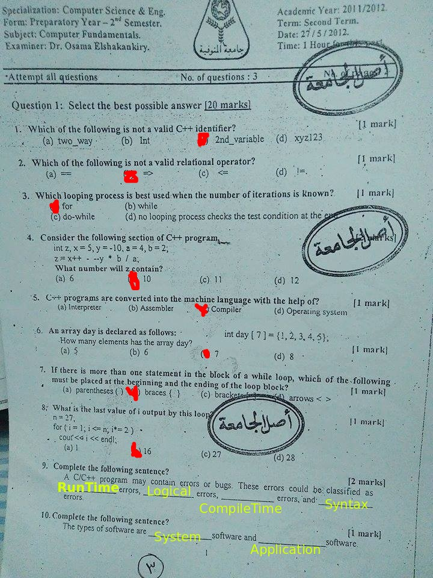
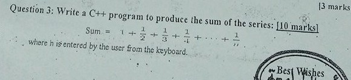

# 2012 Final
---
## Page 1

## Page 2


## 2-3


```cpp
float mark;

	do{
		cout << "Please enter the mark should be between 0 and 100:";
		cin >> mark;
	}while(mark > 100||	mark < 0);
```

## 2-4

```cpp
for(int i=51;i<100;i+=2) cout << i << endl;
```

## 3

```cpp
#include <iostream>

using namespace std;


int main(){

	float sum = 0;
	int n;
	cout << "Enter number: ";
	cin >> n;

	for(int i = 1;i<=n;i++) sum += (1.0/i) ;

	cout << "Sum is " << sum << endl;

}
```
