# Final 2014
---
### Page 1
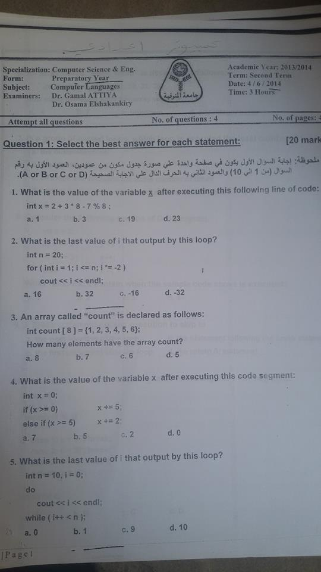
### Page 2
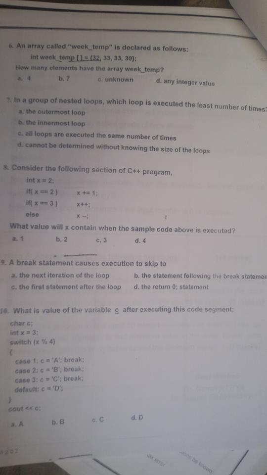
### Question 2
### 1
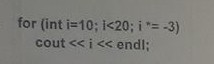
```
10
-30
```
### 2
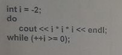
```
-8
```
### 3
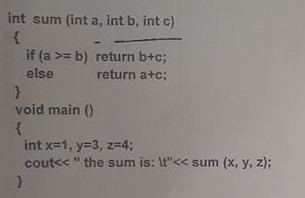
```
the sum is:    5
```
### 4
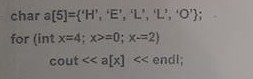
```
O
L
H
```
### 5
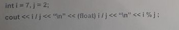
```
3
3.5
1
```
### Question 3
### 1
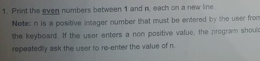
```cpp
int n;
do{
  cout << "Enter N:";
  cin >> n;
}while(n <= 0);

for(int i=1;i<n;i++){
  if(i%2==0)cout << i << "\n";
}
```
### 2
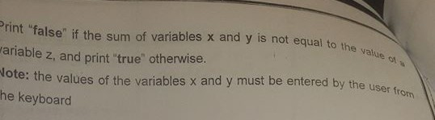
```cpp
int x,y,z;
cout << "Enter 3 Numbers:";
cin >> x >> y >> z;
if(x+y == z) cout << "true";
else 		 cout << "false";
```
### 3
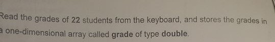

```cpp
const int STUDENT_NUM = 22;
double grade[STUDENT_NUM];

for(int i=0;i<STUDENT_NUM;i++){
  cout << "Enter grade for student " << i+1 << ":";
  cin >> grade[i];
}
```
### 4
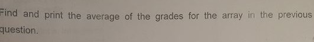
```cpp
double sum = 0;
for(int i=0;i<STUDENT_NUM;i++){
  sum += grade[i];
}
cout << "Avg is " << sum/STUDENT_NUM << endl;
```
### 5
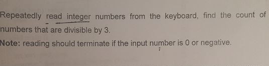
```cpp
int counter=0;
int input;
while(1){
	cin>>input;
	if(input<=0) break;
	if(input%3==0) counter++;
}

cout<<counter;
```
### Question 4
### 1
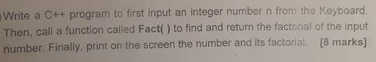
```cpp
#include <iostream>

using namespace std;

long Fact(int n){
	long f = 1;
	for(int i=1;i<=n;i++)f*=i;
	return f;
}

int main(){

	int num;
	cout << "Enter Number:";
	cin >> num;

	cout << num << "! = " << Fact(num) << endl;
}
```
### 2
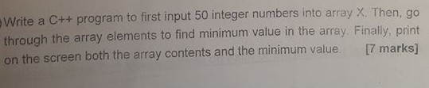
```cpp
#include <iostream>

using namespace std;


int main(){

	const int size = 10;
	int X[size];


	for(int i=0;i<size;i++){
		cout << "Enter #" << i+1 << ":";
		cin >> X[i];
	}

	int min = X[0];
	cout << "Array :\n";
	for(int i=0;i<size;i++){

		if(min > X[i]) min = X[i];

		cout << X[i] << endl;
	}

	cout << "Min is " << min << endl;
}

```
