# 2015 Final
---
## **1**
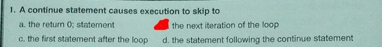    
.    
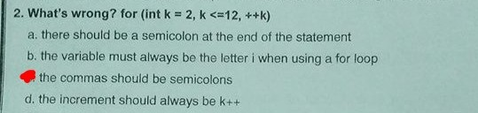    
.    
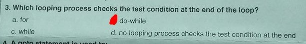    
.    
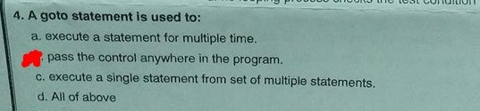    
.    
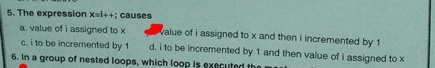    
.    
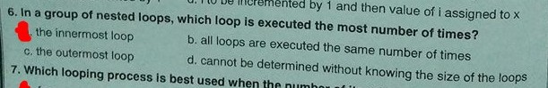    
.    
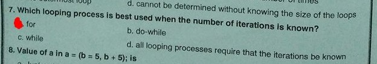    
.    
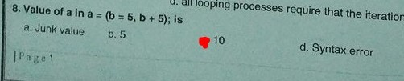    
.    
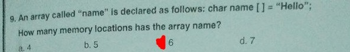    
.    
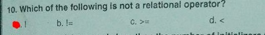    
.    
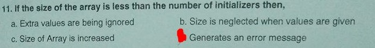    
.    
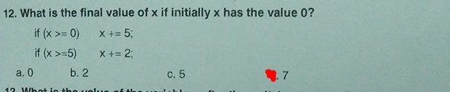    
.    
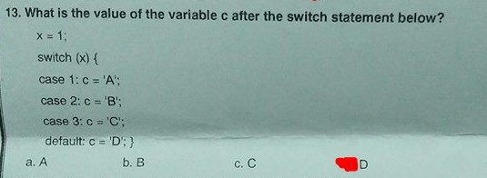    
.    
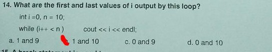    
.    
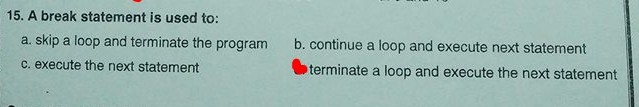    
## **2**
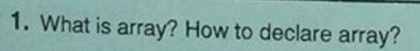    
#### **``  Array is a series of elements of the same type placed in contiguous memory locations that may be individually referenced by adding index to unique identifier  ``**
#### Array Deceleration ``type array_name[length];`` ex ``int array[5];``  
.    
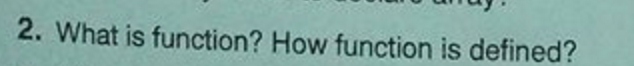    

.    
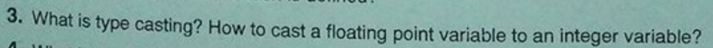    
.    
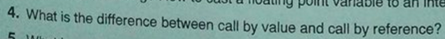    
.    
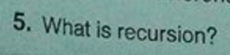        
.    
## **3**
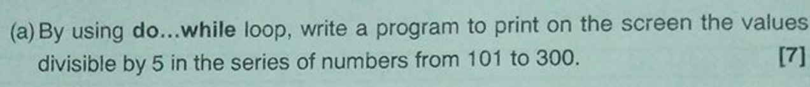
```cpp
#include <iostream>

using namespace std;

int main(){

	for(int i = 101;i<=300;i++){
		if(i%5 == 0) cout << i << endl;
	}

}
```

```cpp
#include <iostream>

using namespace std;

int min(int n1,int n2,int n3){
	int min = n1;
	if(min > n2)min = n2;
	if(min > n3)min = n3;

	return min;
}

int max(int n1,int n2,int n3){
	int max = n1;
	if(max < n2)max = n2;
	if(max < n3)max = n3;

	return max;
}

int main(){

	int a,b,c;

	cout << "Enter 3 Numbers: ";
	cin >> a >> b >> c;

	cout << "Min is " << min(a,b,c) << endl;
	cout << "Max is " << max(a,b,c) << endl;

}
```
## **4**
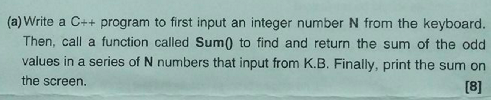    
```cpp
#include <iostream>

using namespace std;

int Sum(int n);


int main(){

    int n;

    cout << "Please enter N:";
    cin >> n;

    cout << "Sum of odd numbers is " << Sum(n) << endl;

}

int Sum(int n){
	int sum = 0;
    while(n!=0){
		int num;
        cout << "Enter Number:";
        cin >> num;
        if(num%2!=0)sum+=num;
        n--;
    }
    return sum;
}

```
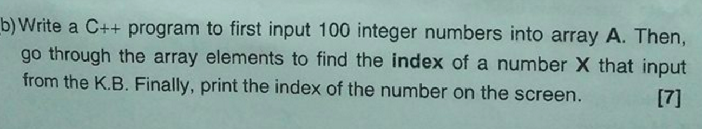    
```cpp
#include <iostream>

using namespace std;

int Sum(int n);


int main(){

	int x;
	const int arrSize = 10;
	int arr[arrSize];

	//input
	cout << "Enter Array elements:\n";
	for(int i=0;i<arrSize;i++){
		cout << "Enter Element " << i + 1 << ": ";
		cin >> arr[i];
	}

	cout << "Search Number:";
	cin >> x;

	int index = -1;  //init value of search index

	for(int i=0;i<arrSize;i++){
		if(arr[i]==x){
			index = i;
			break;
		}
	}

	if(index == -1){
		cout << "Cant find " << x << " inside the array !\n";
	}else{
		cout << x << " was found with the index " << index << endl;
	}
}
```
