# Sheet 3 Control Statements
---
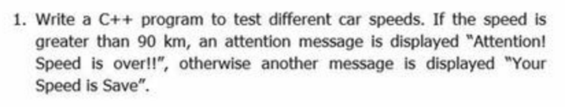
```cpp
#include <iostream>

using namespace std;

int main()
{
    float S;
    cout <<"+~~~~~~~~~~~~~~~~~~~~~~~~~~~~~~~~~~~~~~~~~~~~~~+" <<endl;
    cout <<"! This program is to test different car speeds !" << endl;
    cout <<"+~~~~~~~~~~~~~~~~~~~~~~~~~~~~~~~~~~~~~~~~~~~~~~+" <<endl;
    cout <<"Enter a car speed (km/h): " <<endl;
    cin >> S;
    if(S>90)
    cout <<"Attention!!! Speed is over!!!" <<endl;
    else
    cout <<"Your Speed is Safe"<<endl;


    return 0;
}
```

```cpp
#include <iostream>

using namespace std;

int main()
{
	int a,b;
	cout << "Enter 2 numbers.\n";
	cin >> a >> b;

	cout << "The largest Number is ";

	if(a > b)
		cout << a;
	else
		cout << b;

	cout << endl;


    return 0;
}
```
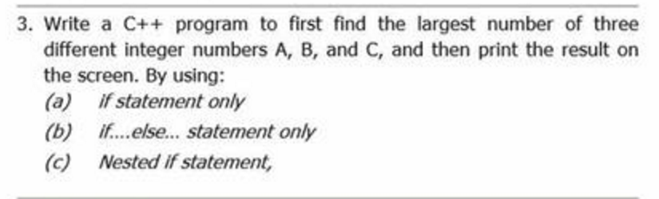
```cpp
#include <iostream>

using namespace std;

int main()
{
	int a,b,c;
	cout << "Enter 2 numbers.\n";
	cin >> a >> b >> c;


	/** A (only if) **/
	if(a > b && a > c) cout << a << endl;
	if(b > a && b > c) cout << b << endl;
	if(c > b && c > a) cout << c << endl;

	/** B (if else) **/
	if(a > b && a > c) cout << a << endl;
	else if(b > c) cout << b << endl;
	else cout << c << endl;

	/** C (Nested if) **/
	if(a > b){
		if(a > c){
			cout << a << endl;
		}
	}
	if(b > a){
		if(b > c){
			cout << b << endl;
		}
	}
	if(c > b){
		if(c > a){
			cout << c << endl;
		}
	}

    return 0;
}
```
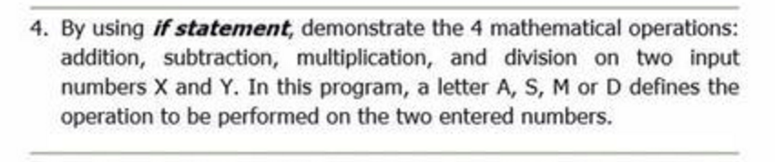
```cpp
#include <iostream>

using namespace std;

int main()
{
	int a,b;
	char o;

	cout << "A:+   S:-   M:*   D:/ \n";
	cout << "Enter number opration number\n";
	cin >> a >> o >> b;

	if(o == 'A'){
		cout << a << " + " << b << " = " << a+b << endl;
	}else if(o == 'S'){
		cout << a << " - " << b << " = " << a-b << endl;
	}else if(o == 'M'){
		cout << a << " * " << b << " = " << a*b << endl;
	}else if(o == 'D'){
		if(b!=0)
			cout << a << " / " << b << " = " << a/b << endl;
		else
			cout << "Can't divide by Zer0\n";
	}else{
		cout << "Wrong Opration \n";
	}

    return 0;
}
```
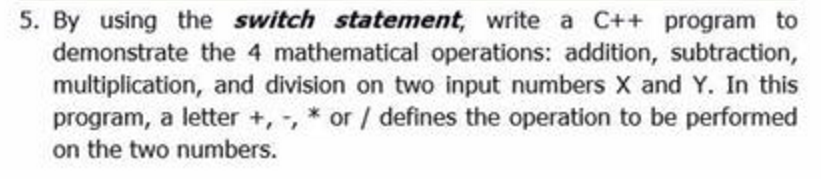
```cpp
#include <iostream>

using namespace std;

int main()
{
	int a,b;
	char o;

	cout << "Enter number opration number\n";
	cin >> a >> o >> b;

	switch(o){
		case '+':
			cout << a << " + " << b << " = " << a+b << endl;
			break;
		case '-':
			cout << a << " - " << b << " = " << a-b << endl;
			break;
		case '*':
			cout << a << " * " << b << " = " << a*b << endl;
			break;
		case'/':
			if(b!=0)
				cout << a << " / " << b << " = " << a/b << endl;
			else
				cout << "Can't divide by Zer0\n";
			break;
		default:
			cout << "Wrong Opration \n";
	}
    return 0;
}
```
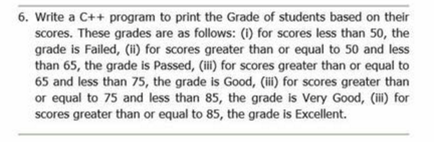
```cpp
#include <iostream>

using namespace std;

int main()
{
	int score;
	cout << "Enter student score\n";
	cin >> score;

	if(score < 50){
		cout << "Failed\n";
	}else if(score < 65){
		cout << "Passed\n";
	}else if(score < 75){
		cout << "Good\n";
	}else if(score < 85){
		cout << "Very Good\n";
	}else{
		cout << "Excellent\n";
	}

    return 0;
}
```
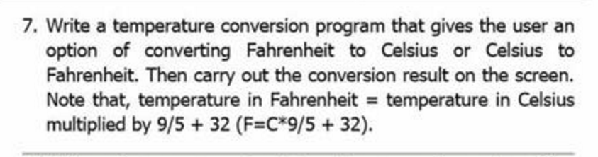
```cpp
#include <iostream>

using namespace std;

int main()

{
    int choice;
    float c,f;
    cout <<"Please Type 1 to convert from F-to-c or 2 to convert from c-to-f :"<<endl;
    cin >> choice;
    if(choice==1){
       cout << "enter the Fahrenheit temperature:";
       cin>>f;
       c=(f-32)*5/9;
       cout <<"The Celsius temperature is "<<c<<endl;
    }else if(choice==2){
       cout << "enter the Celsius temperature:";
       cin>>c;
       f=c*9/5 + 32;
       cout <<"the Fahrenheit temperature is "<<f<<endl;
    }else{
		cout << "Wrong choice" << endl;
	}


    return 0;
}
```
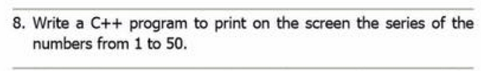
```cpp
#include <iostream>

using namespace std;

int main(){
	for (int i=1;i<=50;i++){
		cout << i << endl;
	}

}
```
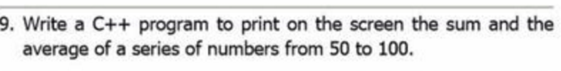
```cpp
#include <iostream>

using namespace std;

int main(){

	int sum = 0;

	for (int i=50;i<=100;i++){
		sum+=i;
	}

	cout << "Sum :" << sum << endl;
	cout << "Avg :" << sum/51.0 << endl;

}
```
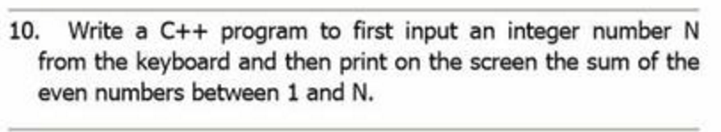
```cpp
#include <iostream>

using namespace std;

int main(){

	int n;
	int sum = 0;

	cout << "n:";
	cin >> n;

	for (int i=2;i<n;i++){
		if(i%2==0)sum+=i;
	}

	cout << "Sum :" << sum << endl;

}
```
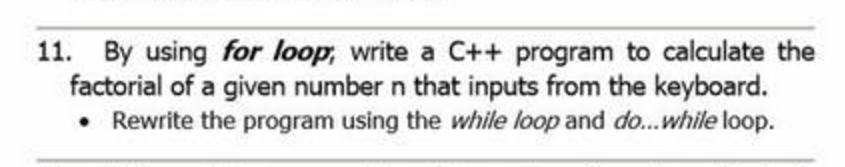
```cpp
#include <iostream>

using namespace std;

int main(){

	int n;
	long f;
	cout << "Number :";
	cin >> n;

	/** for **/
	f = 1;
	for(int i = 1;i<=n;i++) f*=i;

	cout << f << endl;

	/** while **/
	f = 1;
	int j = 1;
	while(j<=n) f*=j++;

	cout << f << endl;

	/** do while **/
	f = 1;
	int k = 1;
	do{
		f*=k;
	}while(++k <= n);

	cout << f << endl;


}
```
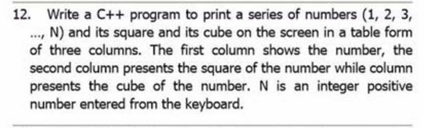
```cpp
#include <iostream>

using namespace std;

int main(){

	int n;

	do{
		cout << "n:";
		cin >> n;
	}while(n<=0)

	for (int i=1;i<=n;i++){
		cout << i << "\t" << i*i << "\t" << i*i*i << endl;
	}

}
```
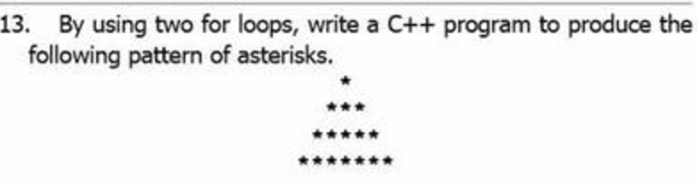
```cpp
#include <iostream>

using namespace std;

int main(){

	int b = 9;			//Base
	int halfB = b/2;	//Half Base
	int h = halfB + 1;	//Height


	for(int i = 0;i<h;i++){

		for(int j =0;j<b;j++){
			if( j>=(halfB-i) && j<=(halfB+i))
				cout << "*";
			else
				cout << " ";
		}

		cout << endl;
	}

}
```
